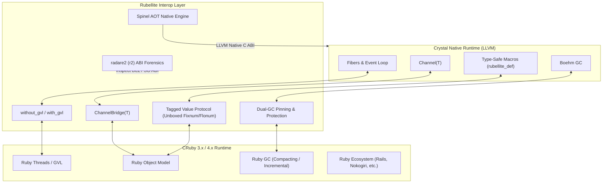

<div align="center">

# 💎 Rubellite

<!-- carbon:badges -->
[](https://github.com/sol-vin/rubellite/actions/workflows/ci.yml)
[](https://sol-vin.github.io/rubellite/)
[](https://github.com/sol-vin/rubellite/releases)
[](https://crystal-lang.org)
[](#)
[](LICENSE)
<!-- /carbon:badges -->


**Next-Generation Bidirectional Crystal $\leftrightarrow$ Ruby Interop, Spinel AOT Compiler, Concurrency Channels & radare2 Diagnostics**

</div>

---

**Rubellite** is a production-grade, zero-overhead bridge connecting the **Crystal** and **Ruby** ecosystems. Built with the architectural rigor of [`lapis`](https://github.com/sol-vin/lapis) and [`opal`](https://github.com/sol-vin/opal), Rubellite enables full bidirectional interop, seamless Communicating Sequential Processes (CSP) concurrency with Crystal Channels, Matz's **Spinel** AOT native compiler fast-path, and deep binary ABI diagnostics powered by **radare2**.

Named after the vibrant deep-red gemstone, Rubellite bridges Ruby's expressive dynamism with Crystal's bare-metal LLVM performance.

---

## 🏛️ Architecture



---

## ✨ Features

- **Bidirectional Interoperability**: Call any Ruby gem, class, or block from Crystal; call Crystal functions, classes, and native algorithms from Ruby.
- **Zero-Allocation Immediate Values**: 64-bit unboxed integers (`Fixnum`), floats (`Flonum`), symbols, and booleans with zero heap allocation overhead.
- **Cross-Language CSP & Channels**: Full `Rubellite::Channel(T)` bridge exposed to Ruby as `Crystal::Channel`, enabling seamless fiber-to-thread message passing.
- **GVL Management**: Non-blocking long-running Crystal operations executed outside the Global VM Lock (`without_gvl`) so Ruby threads continue concurrently.
- **Dual-GC Pinning**: Bidirectional memory management keeping Ruby objects alive during Crystal operations and Crystal objects referenced safely.
- **Matz's Spinel AOT Integration**: Directly invoke Matz's Spinel AOT compiler (`matz/spinel`) to generate native C ABI functions with up to **293x speedup**.
- **radare2 Forensics (`r2`)**: Embedded binary analysis via `cradare2` to inspect symbol tables, detect ABI calling convention mismatches, and trace native calls.
- **Clean Windows ABI Import Library**: Automated extraction and stripping of 26 conflicting Win32 symbol overrides (e.g. `Sleep`, `write`, `close`) from Ruby's DLL to prevent runtime collisions with Crystal's event loop.
- **High-Level Metaprogramming DSL**: `rubellite_class`, `rubellite_def`, and `Rubellite::Proxy` macros that auto-generate type conversions and wrappers.

---

## 🚀 Installation

Add `rubellite` to your `shard.yml`:

```yaml
dependencies:
  rubellite:
    github: sol-vin/rubellite
    branch: main
```

Run:

```bash
shards install
```

### System Requirements

- **Crystal**: `>= 1.10.0`
- **Ruby**: `>= 3.0` (CRuby 3.2, 3.3, or 4.0 recommended)
- **radare2**: `>= 5.8.0` (optional, for binary diagnostics and import lib generation)
- **C Compiler**: `gcc` / `clang` / `cl` (for Spinel native compilation and C extensions)

---

## ⚡ Quick Start

```crystal
require "rubellite"

# Initialize embedded Ruby VM
Rubellite.init

# Direct evaluation
puts Rubellite.eval("1 + 2 * 3").as_i   # => 7
puts Rubellite.eval("'Hello from ' + RUBY_DESCRIPTION").as_s

# Access Ruby classes and call methods
math = Rubellite["Math"]
result = math.call("sqrt", 144)
puts result.as_f   # => 12.0

# Cleanup at shutdown
Rubellite.cleanup
```

---

## 📖 In-Depth Usage Guide

### 1. Crystal Calling Ruby

#### Dynamic Dispatch & Fluent Method Chaining

Every `Rubellite::Value` supports dynamic method invocation with native Crystal argument passing:

```crystal
require "rubellite"

Rubellite.init

# Call Ruby standard library methods
str = Rubellite.eval("'rubellite gemstone'")
puts str.call("capitalize").as_s                     # => "Rubellite gemstone"
puts str.call("gsub", "gemstone", "tourmaline").as_s # => "rubellite tourmaline"

# Arrays and Hashes
array = Rubellite.eval("[10, 20, 30, 40]")
puts array.size               # => 4
puts array[2].as_i            # => 30

array.call("push", 50)
puts array.to_a.map(&.as_i)   # => [10, 20, 30, 40, 50]
```

#### Blocks and Closures

Pass Crystal blocks directly into Ruby methods:

```crystal
words = Rubellite.eval("['crystal', 'ruby', 'rubellite']")

# Iterate with a block
words.call_block("each") do |item|
  puts "Item: #{item.as_s.upcase}"
end

# Map with a block
lengths = words.call_block("map") do |item|
  item.as_s.size.to_ruby
end
puts lengths.to_a.map(&.as_i) # => [7, 4, 9]
```

#### Using External Ruby Gems

Load any installed Ruby gem using `Rubellite.require`:

```crystal
Rubellite.require("json")
Rubellite.require("digest")

digest = Rubellite["Digest::SHA256"]
hash = digest.call("hexdigest", "crystal-ruby-interop")
puts "SHA256: #{hash.as_s}"
```

---

### 2. Ruby Calling Crystal

#### Defining Ruby Methods and Classes in Crystal

Use `rubellite_class` and `rubellite_def` to export Crystal types and functions directly to Ruby:

```crystal
require "rubellite"

Rubellite.init

rubellite_class "CrystalCalculator" do
  # Export typed Crystal method to Ruby
  rubellite_def "add", a : Int32, b : Int32 do
    (a + b).to_ruby
  end

  # Computation-heavy native algorithm
  rubellite_def "fast_fib", n : Int32 do
    fib = ->(x : Int32) : Int64 {
      a, b = 0_i64, 1_i64
      x.times { a, b = b, a + b }
      a
    }
    fib.call(n).to_ruby
  end
end

# In Ruby script:
ruby_code = <<-RUBY
  calc = CrystalCalculator.new
  puts "Add from Crystal: #{calc.add(40, 2)}"
  puts "Fib(50) from Crystal: #{calc.fast_fib(50)}"
RUBY

Rubellite.eval(ruby_code)
```

#### Typed Proxy Wrappers

Wrap Ruby objects in strongly-typed Crystal interfaces using `Rubellite::Proxy`:

```crystal
class UserProxy < Rubellite::Proxy
  ruby_method name : String
  ruby_method age : Int32
  ruby_method active? : Bool
end

raw_user = Rubellite.eval("Struct.new(:name, :age, :active).new('Alice', 28, true)")
user = UserProxy.new(raw_user)

puts user.name     # => "Alice" (typed as String)
puts user.age      # => 28      (typed as Int32)
puts user.active?  # => true    (typed as Bool)
```

---

### 3. Concurrency & Channels (CSP)

Rubellite bridges Crystal's fiber-based CSP concurrency model with Ruby threads using `Rubellite::Channel(T)` and `Crystal::Channel`.

```crystal
require "rubellite"

Rubellite.init

# Create a typed channel
channel = Rubellite::Channel(Int32).new(capacity: 10)

# Expose to Ruby as a global or argument
Rubellite.set_global("$task_channel", channel.to_ruby)

# Start a background Crystal worker fiber
spawn do
  while item = channel.receive?
    puts "[Crystal Fiber] Processed task: #{item}"
  end
  puts "[Crystal Fiber] Worker finished."
end

# Produce work from Ruby threads
Rubellite.eval(<<-RUBY)
  Thread.new do
    5.times do |i|
      $task_channel.push(i * 10)
      sleep 0.05
    end
    $task_channel.close
  end.join
RUBY

# Release GVL during heavy Crystal operations
Rubellite.without_gvl do
  # Ruby threads can run in parallel while Crystal executes here
  sleep 0.1.seconds
end
```

---

### 4. Matz's Spinel AOT Integration

Matz's [Spinel](https://github.com/matz/spinel) compiles a typed subset of Ruby into native C. Rubellite incorporates an automated Spinel AOT engine that generates direct C ABI entrypoints callable from Crystal with zero VM overhead:

```crystal
require "rubellite/spinel"

# High-performance Ruby algorithm
ruby_source = <<-RUBY
  def mandelbrot_pixel(cr, ci, max_iter)
    zr = 0.0
    zi = 0.0
    i = 0
    while i < max_iter
      zr2 = zr * zr
      zi2 = zi * zi
      if zr2 + zi2 > 4.0
        return i
      end
      zi = 2.0 * zr * zi + ci
      zr = zr2 - zi2 + cr
      i = i + 1
    end
    max_iter
  end
RUBY

# Compile directly via Rubellite's Spinel Engine
fn = Rubellite::Spinel::Engine.compile_function(
  ruby_source,
  func_name: "mandelbrot_pixel",
  param_types: [
    Rubellite::Spinel::Type::Float64,
    Rubellite::Spinel::Type::Float64,
    Rubellite::Spinel::Type::Int32
  ],
  return_type: Rubellite::Spinel::Type::Int32
)

# Execute at native LLVM / C speed without Ruby VM overhead
iter = fn.call(-0.5, 0.5, 1000)
puts "Mandelbrot pixel iterations: #{iter}"
```

---

### 5. radare2 Diagnostics (`r2`)

Rubellite integrates directly with `radare2` via `cradare2` to provide deep binary forensics, symbol inspection, and crash investigation:

```crystal
require "rubellite/diagnostics/r2"

# Inspect the loaded Ruby dynamic library
report = Rubellite::Diagnostics::R2.inspect_binary(Rubellite::Tooling::ImportLibGenerator.find_ruby_dll)

puts "Library: #{report.path}"
puts "Arch:    #{report.arch}"
puts "Bits:    #{report.bits}"
puts "Exports: #{report.exported_symbols.size} symbols"

# Disassemble a specific Ruby internal function
disasm = Rubellite::Diagnostics::R2.disassemble_symbol(report.path, "rb_eval_string")
puts disasm
```

---

## 📊 Benchmarks

Benchmark executed with `rubellite bench` (Mandelbrot set calculation, $200 \times 200$ grid, 1,000 iterations):

| Implementation | Execution Time | Speedup vs CRuby |
|:---|:---:|:---:|
| **Spinel AOT Native** | **2.65 ms** | **293.6x faster** |
| **Crystal Pure Native** | **25.46 ms** | **30.6x faster** |
| **CRuby 4.0 (YJIT enabled)** | **778.07 ms** | Baseline ($1.0\times$) |

---

## 🛠️ CLI Usage

Rubellite provides a built-in CLI tool:

```bash
# Verify environment, Ruby DLL, C compiler, and radare2
rubellite doctor

# Run interactive benchmarks
rubellite bench

# Evaluate Ruby code directly from terminal
rubellite eval "puts 'Crystal-powered Ruby: ' + RUBY_VERSION"

# Run a Ruby script through the Rubellite engine
rubellite run script.rb
```

---

## 🧪 Testing

Rubellite has a comprehensive test suite covering the entire API:

```bash
# Run all specs
make spec
# Or with crystal directly:
crystal spec --verbose spec/all_spec.cr
```

---

## 🤝 Contributing

1. Fork the repository (`https://github.com/sol-vin/rubellite/fork`)
2. Create your feature branch (`git checkout -b feature/amazing-feature`)
3. Commit your changes (`git commit -am 'Add some amazing feature'`)
4. Push to the branch (`git push origin feature/amazing-feature`)
5. Open a Pull Request

---

## 📄 License

This project is licensed under the MIT License - see the [LICENSE](LICENSE) file for details.
